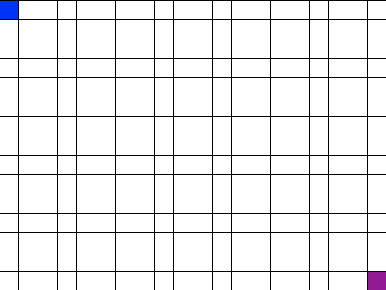
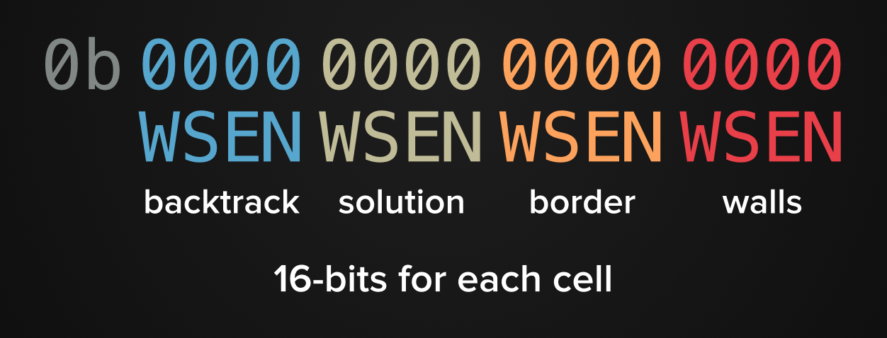
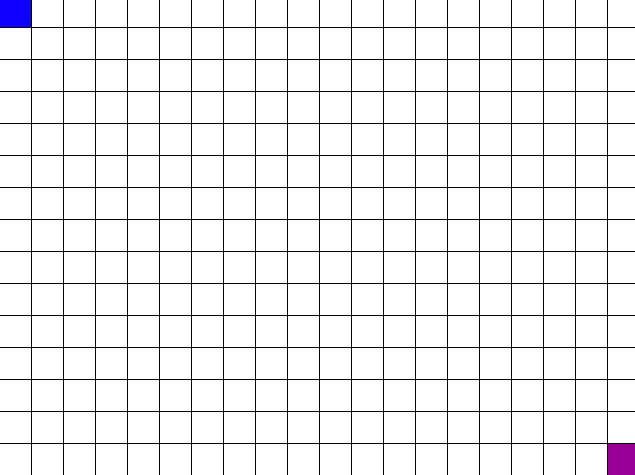

Let's have some fun with trees! We'll use depth first search to generate a perfect maze and then use both depth first search and breadth first search to solve the maze. We'll also get some practice with bit manipulation since our maze class will represent each cell as a 16-bit number.

> [info]
>
> A *perfect maze* is a maze with only one path between any two cells. Since there is only one path between any two points you can represent a *perfect maze* as a tree. Lucky for us, *perfect mazes* are the easiest type of maze to create programmatically.
>
> Check out [this video](https://www.youtube.com/watch?v=k1tSK5V1pds) for a visualization of a *perfect maze* transforming into a tree and back into a maze.

# Getting Started

> [action]
>
> 1. Go to the [assignment page](https://classroom.github.com/assignment-invitations/742a24d0861bd7d3b4a946784fa10f37)
> 2. Accept the assignment and follow the link to the created repository
> 3. Clone the repository and use it throughout this project

This project makes use of `pygame` for visualization so you'll have to install a few dependancies before it'll run. Run the following command to install the `pygame` dependancies:

    $ brew install mercurial sdl sdl_image sdl_mixer sdl_ttf smpeg portmidi Caskroom/cask/xquartz

Now it's time to set up our virtual environment. First, find out the file path to Python 3 by running this command:

	$ which python3

On my machine, this outputs `/usr/local/bin/python3`, but it might be different for you.

Then, run the `virtualenv` command supplying the path to the Python 3 interpreter after with the `-p` flag, followed by the name of the virtual environment directory, in this case `venv`:

	$ virtualenv -p /path/to/python3 venv

You should see some nice logging output telling you what `virtualenv` is doing.

There is still one more step before `virtualenv` is activated, i.e. before we are _actually_ using our virtual environment instead of our regular one. We need to activate it! Run this command to activate:

	$ source venv/bin/activate

Now that we created our virtual environment and activated it, let's install `pygame`. It's already listed in `requirements.txt` so we just need to run:

    $ pip3 install -r requirements.txt

# Maze Cells

Maze generation begins with a grid of cells. Each cell starts with walls between itself and its neighboring cells.

To go from a grid of unconnected cells to a *perfect maze* we need to knock down some of those walls. We'll choose a random cell to start from and traverse the grid using depth first search. Whenever a new cell is visited, the wall between the new cell and the previous cell is knocked down.

This means that each cell needs to store its knocked down walls. We will be solving the maze using depth first search so each cell also needs to store if the solution or backtrack path passes through it. The start cell (or root node) will always be the top-left most cell. The exit cell (or goal node) will always be the bottom-right most cell. A fully solved maze can be seen below. Green represents the solution path and red represents the backtracked path.

## Cell Data Structure

We will be using the maze data structure described by [MazeWorks](https://web.archive.org/web/20150306191401/http://www.mazeworks.com/mazegen/mazetut/index.htm) and partially implemented [here](http://forums.tigsource.com/index.php?topic=4589.0). To summarize, each cell is represented by 16-bits.

1. The left-most set of 4-bits store the backtrack path
2. The next set of 4-bits store the solution path
3. The next set of 4-bits store if a cell is on the maze border
4. The right-most set of 4-bits stores which walls have been knocked down

Each bit in the 4-bit sets corresponds to a cardinal direction. From left-to-right the bits represent west, south, east, north. This means each cell will start as 16-bits of zero (`0b0000000000000000`).

The top-left cell of the above image can be represented as `0b0000010010010110`. That is:

1. 0000 for no backtrack path passing through
2. 0100 for solution path passing through to the south
3. 1001 for maze borders to the west and the north
4. 0110 for knocked down walls to the south and the east

Storing cells as 16-bits will allow us to use [bit manipulation](https://en.wikipedia.org/wiki/Bit_manipulation) to modify and retrieve data! The maze itself is stored as a list of 16-bit numbers.

> [info]
>
> The starting code does not make use of the four border bits. It uses the minimum and maximum list indices instead. This is a bit easier to implement but means that the code needs to be updated before non-rectangular mazes can be generated and solved!

## Provided Code

Before we can get started generating a maze, we need finish up the `Maze` class. Open up `maze.py` and take a look at the provided code. All of the code needed for storing and visualizing a maze is provided but the logic for manipulating each cell of the maze has been left out.

Take note of the variables provided at the top of `maze.py` -- they'll be handy as you finish up the Maze class.

# Bit Manipulation

Let's dive right into bit manipulation and finish up the methods that maze generation needs!

> [info]
>
> In Python, we can express a number using bits by starting it off with `0b`. The number is stored as an integer but we can see the binary representation using `bin(number)`. Play around with this notation in the Python interpreter until you get the hang of it.
>
>	$ python 3
>       >>> x = 0b1011
>       >>> x
>       11
>       >>> bin(x)
>       '0b1011'

## cell_neighbors

`cell_neighbors` takes a cell and returns its neighbors. It does not return every neighbor though! It filters the neighbors according to the `state` of the maze. When finished, our maze will have three states: idle, create, solve. Right now we are only worried about the create state. During creation, the only neighbors we care about are those without any walls knocked down -- this means the cell has not been visited yet.

> [action]
>
> Complete the implementation of `cell_neighbors` so that it:
>
>     creates empty list of neighbors
>     for each direction
>         calculate new cell from cell
>         if new cell in that direction is within the bounds of maze
>             if state is create and all of new cell's walls are up
>                 add (new cell index, COMPASS index of direction) to neighbors
>     return neighbors
>
> You can check if all walls are still up using a *bitwise AND* (`&` in Python). *Bitwise AND* compares the bits between two numbers -- each bit of the output is 1 if the corresponding bit of x and y is both 1, otherwise it is 0. Play around with `&` in the Python interpreter to get a feel for it.
>
> We can use `WALL_BITS` (0b0000000000001111) to check if any of the 4-bits representing knocked down walls have been set. If a cell has all of its walls up, the right-most bits will all be zero and `self.maze_array[cell] & WALL_BITS` will evaluate to zero...
>
> Make sure to store the new cell index and compass index as a tuple. The returned list should look something like this:
>
>     [(1, 0), (3, 3)]
>
> This represents two unvisited neighboring cells. The first is at cell index `1` and to the left (`COMPASS[0]`), the second is at cell index `3` and to the right (`COMPASS[3]`). These `COMPASS` indices will come in handy soon since the indices of `WALLS` and `OPPOSITE_WALLS` match up.

<!-- Make School -->

> [solution]
>
> The completed `cell_neighbors` method should look like this:
>
>     def cell_neighbors(self, cell):
>         x, y = self.x_y(cell)
>         neighbors = []
>         for i in range(4):
>             new_x = x + COMPASS[i][0]
>             new_y = y + COMPASS[i][1]
>             if self.cell_in_bounds(new_x, new_y):
>                 new_cell = self.cell_index(new_x, new_y)
>                 if self.state == 'create':
>                     if not (self.maze_array[new_cell] & WALL_BITS):
>                         neighbors.append((new_cell, i))
>         return neighbors

## connect_cells

`connect_cells` is expected to update the 4-bits storing knocked down walls for the `from_cell` and the `to_cell`. To do this, we can use *bitwise OR* (`|` in Python). *Bitwise OR* compares the bits between two numbers -- each bit of the output is 1 if either corresponding bit of x or y is 1, otherwise it is 0. Play around with `|` in the Python interpreter to get a feel for it. Bitwise OR will allow us to add data in without erasing the old data.

> [action]
>
> Complete the implementation of `connect_cells` using `|`. `self.maze_array[from_cell] = self.maze_array[from_cell] | WALLS[compass_index]` will update the `from_cell`. Do the same with `to_cell` using `OPPOSITE_WALLS`. Leave the call to `draw_connect_cells` or else the maze visualization will not be updated!

<!-- Make School -->

> [solution]
>
> The completed `connect_cells` method should look like this:
>
>     def connect_cells(self, from_cell, to_cell, compass_index):
>         self.maze_array[from_cell] |= WALLS[compass_index]
>         self.maze_array[to_cell] |= OPPOSITE_WALLS[compass_index]
>         self.draw_connect_cells(from_cell, compass_index)

<!-- Make School -->

> [info]
>
> `x |= y` is short hand for `x = x | y`. This `operator=` short hand also works for `-`, `+`, `*`, `/`, `%`, `&`.

Great! We can move on to generating mazes now that we have both of those working!

# Generating a maze

We want to use *depth first search* to generate our mazes. More specifically, we want to use randomized, pre-order depth first search. Pre-order means we *visit* or 'knock down walls for' a cell before continuing to its potential children (unvisited neighbors). Randomized means we pick a random but unvisited neighbor to continue our traversal.

When we hit a dead end (cell with no unvisited neighbors), we will 'backtrack' to the most recent cell that still has children to *visit* (unvisited neighbors). Backtrack cells are stored in a stack.

> [info]
>
> As we generate a maze, we are essentially creating a [spanning tree](https://en.wikipedia.org/wiki/Spanning_tree) from a grid graph. This means we are creating a tree that connects each cell in the grid.

## Pseudocode for Generating a Maze

    create a stack for backtracking
    choose a cell index at random from the grid to be current cell
    set visited cells to 1

    while visited cells < total cells
        get unvisited neighbors using cell_neighbors
        if at least one neighbor
            choose random neighbor to be new cell
            knock down wall between it and current cell using connect_cells
            push current cell to stack
            set current cell to new cell
            add 1 to visited cells
        else
            pop from stack to current cell
        call refresh_maze_view to update visualization

    set state to 'solve'

> [action]
>
> Implement the pseudocode above in the `create_dfs` function of `generate_maze.py`. Run `python3 generate_maze.py` to see if your maze is generating correctly!

If you did everything right, your maze generation should look like this:

